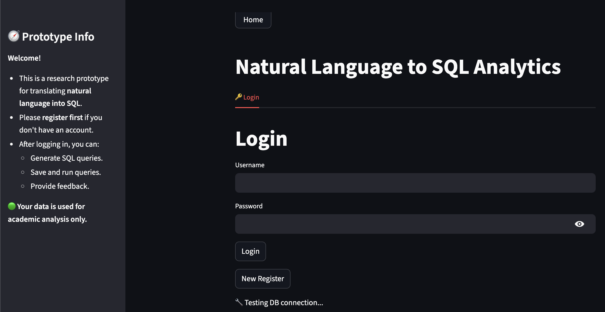
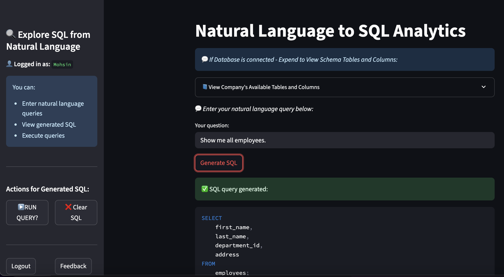

# 🧠 Generative AI Powered: Natural Language to SQL Prototype Application

A prototype application which is deployed on Streamlit Community Cloud that transforms **natural language** into **SQL queries**, allowing users to explore a company's database using everyday English.

---

### 🚀 Live Demo (Temporary)

[Click here to try the app!](https://nl2sql-prototype.streamlit.app/)

---
## App Login Screenshot
(https://nl2sql-prototype.streamlit.app/)

## App Dashboard Screenshot (Once Logged-in)


---

## 🚀 Features

- 🔐 User registration & login system (PostgreSQL + bcrypt)
- 📋 Consent form signing with auto-generated PDF
- ☁️ PDF storage to AWS S3
- 🧪 Questionnaire feedback module
- 🗃️ Query interface for company data (using SQLite)
- 🖥️ CI/CD support with Streamlit Cloud

---


## 🧭 How to Use This App

### 👥 For New Users

1. **Register**
   - Click on **"New Register"**
   - Fill in your **first name**, **last name**, **username**, and **password**
   - Click **"Register"** to create your account

2. **Login**
   - Enter your **username** and **password**
   - You'll be redirected to the dashboard

3. **Ask Questions**
   - Type a question like:
     - _“Show all employees in the marketing department”_
     - _“Total sales by employee last month”_
   - View the SQL and results directly!

4. **View Schema**
   - Expand the **schema viewer** to understand what tables and columns are available

---

### 📄 Consent & Feedback

- Users are shown a **consent page** when giving feedback
- A **PDF** of their agreement is generated and **uploaded securely** to the cloud
- Feedback is collected via a short **questionnaire**

---

## 💻 Tech Stack

| Layer       | Technology         |
|-------------|--------------------|
| Frontend    | Streamlit          |
| Backend     | Python (fpdf, psycopg2, boto3) |
| Database    | PostgreSQL (for users & feedback) + SQLite (for company.db) |
| Storage     | AWS S3 |
| Hosting     | Streamlit Cloud |

---

## 🧪 Example Questions to Try

- “List all employees in marketing.”
- “What is the total sales for each department?”
- “Show employees who joined after 2022.”
- “Top 3 sales employees by revenue.”

---


## 📂 Project Structure

```bash
.
├── assests/           # static files, images etc.
├── backend/           # Auth, registration, database logic
├── database/          # Local SQLite files (e.g., company.db)
├── utils/             # Utility functions (PDF generation, S3 upload, Handle pages etc.)
├── views/             # Streamlit UI pages: login, register, consent, etc.
├── main.py            # App entry point
├── requirements.txt   # Python dependencies
└── README.md

